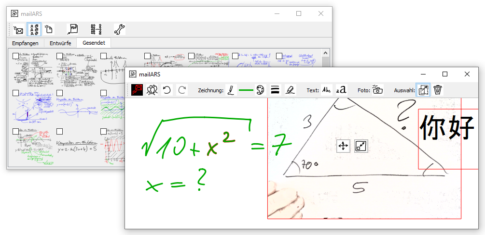

*Für die deutsche Version bitte hinunterscrollen*

# What is mailARS?

mailARS is a quizzing (aka audience response) system to be used in face-to-face classrooms and particularly in virtual classrooms, alongside a videoconferencing solution.

These are its main features:

* Students can work on complex problems on their own and submit partial solutions to the teacher.

* Students can work by drawing, typing, and/or taking photos of work done on paper. They are not confined to picking one of A, B, C, D as in standard audience response systems.

* Teachers can use mailARS as the central whiteboard to develop their lessons (and transmit this whiteboard in real time through the video conferencing system). To this end, the user interface can be hidden so that only a truly *white* board is left. On this whiteboard, teachers can create problems on the fly and send those to their students for editing and/or completion.

* mailARS runs on many operating systems, thanks to Python and Qt.

* mailARS is neutral with respect to the GDPR as it does no rely on external servers but rather leverages the school's standard mail system (SMTP/IMAP), for which GDPR-conformant documentation and regulations already need to be in place. To the data protection officer, mailARS should be nothing more than an e-mail client with a somewhat fancy user interface.

# Use of this repo

This repo can be employed as-is by teachers and their students: Download it as a .zip file (Github's green button) and unpack it. Detailed instructions for installation and use are included in the [user manual](__USER_MANUAL__.html).

As not all schools run plain-vanilla SMTP/IMAP mail systems, admins (or students, just saying) may use this repo to customize the communication with the server, mostly in the file [mailing.py](mailing.py). Please submit such customizations for inclusion in this repo.

Many features may be improved or added, for instance plotting, the embedding of PDF files, the embedding of browser windows, and recording and editing functions to create Khan-style videos on the fly. Everybody is welcome to contribute, preferably after consultation.

# Contact information

Jörn Loviscach  
[j3L7h.de](j3l7h.de)

---

# Was ist mailARS?

mailARS ist ein Aufgabenbearbeitungs-System oder Audience-Response-System für traditionellen Unterricht, aber insbesondere für Fernunterricht, wo es in Verbindung mit einer Videokonferenzlösung laufen kann.

Seine wesentlichen Eigenschaften:

* Die Lernenden können komplexe Probleme allein bearbeiten und auch Teillösungen und Lösungswege an Lehrende schicken.

* Die Lernenden können zeichnen, tippen oder von Papier fotografieren. Sie sind nicht wie in üblichen Audience-Response-Systemen darauf beschränkt, sich zwischen A, B, C oder D zu entscheiden.

* Lehrende können mailARS als zentrale Tafel benutzen, die sie dann auch in Echtzeit per Videokonferenzsystem übertragen. Dazu kann das Bedieninterface komplett verborgen werden, so dass nur das weiße Rechteck des Fensters bleibt. Dort kann man Aufgabe im Fluge entwickeln und an die Lernenden senden, die sie dann editieren und/oder vervollständigen können.

* mailARS läuft auf vielen Betriebssystemen, dank Python und Qt.

* mailARS ist neutral bezüglich der DSGVO, weil es keine externen Server verwendet, sondern nur den Mail-Server (SMTP/IMAP) der jeweiligen Institution. Für diesen müssen Dokumentation und Regelungen gemäß DSGVO bereits vorliegen. Aus Datenschutzsicht sollte mailARS nichts anderes sein als ein E-Mail-Programm mit ungewöhnlicher Bedienoberfläche.

# Nutzung dieses Repo

Dieses Repo kann so, wie es ist, von Lehrenden und Lernenden verwendet werden: Laden Sie es als Zip-Datei herunter (grüner Knopf auf Github) und entpacken sie es. Detaillierte Anweisungen zu Installation und Bedienung finden Sie in der [Anleitung](__ANLEITUNG__.html).

Weil nicht alle Institutionen Standard-SMTP/IMAP-Mailsysteme benutzen, können Admins (oder Studierende!) dieses Repo verwenden, um mailARS an ihr System anzupassen, hauptsächlich in der Datei [mailing.py](mailing.py). Bitte solche Anpassungen hier allgemein zur Verfügung stellen, danke!

Vieles könnte noch hinzugefügt oder verbessert werden, zum Beispiel Plotfunktionen, das Einbetten von PDFs, das Einbetten von Browserfenstern sowie das Aufnehmen und Editieren von Khan-Stil-Videos im Fluge. Beiträge sind erwünscht, möglichst nach Absprache.

# Kontakt

Jörn Loviscach  
[j3L7h.de](j3l7h.de)